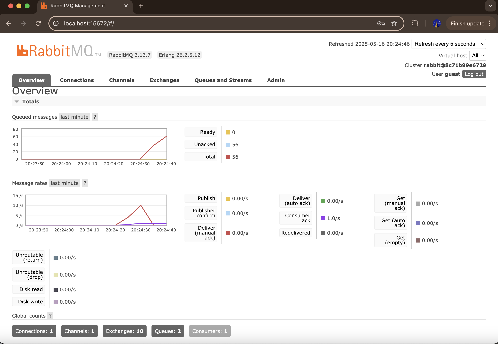
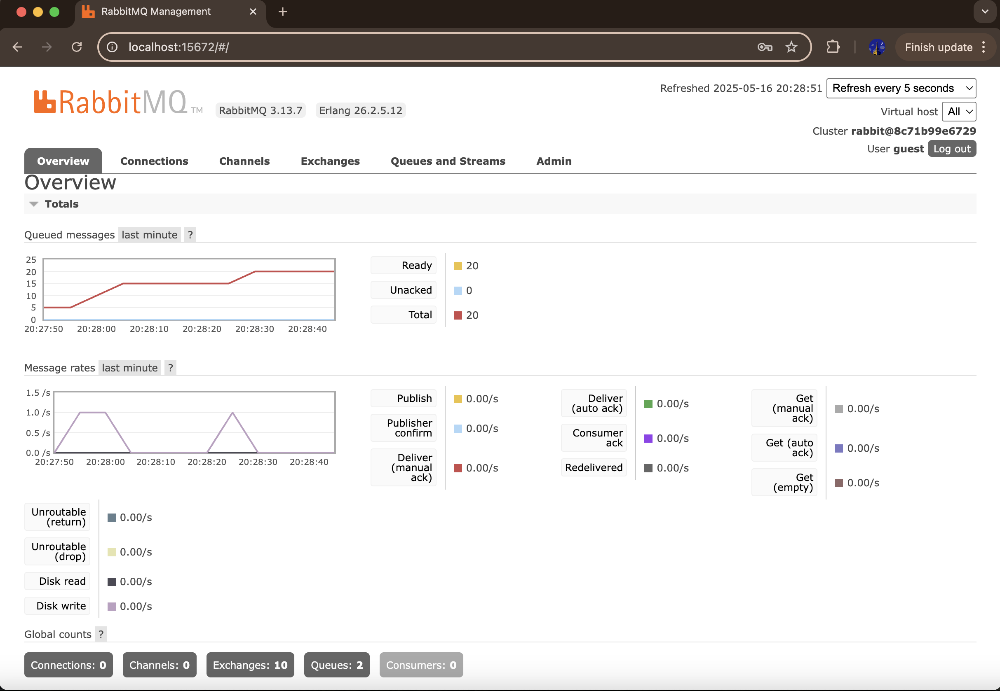

# advprog-9-subscriber
Agus Tini Sridewi / 2306276004/ ADPRO A

#### a. What is amqp?

AMQP (Advanced Message Queuing Protocol) adalah standar terbuka untuk mengirimkan pesan bisnis antar aplikasi atau organisasi. AMQP memungkinkan komunikasi yang andal, antrian pesan, dan pemrosesan asinkron dalam sistem terdistribusi. Dalam kode ini, AMQP digunakan untuk menangani pesan antar layanan menggunakan antrian.

#### b. What does it mean? guest:guest@localhost:5672 , what is the first guest, and what is the second guest, and what is localhost:5672 is for?

guest:guest@localhost:5672 adalah format URL yang digunakan untuk menghubungkan ke server AMQP (seperti RabbitMQ).
- "guest" pertama adalah nama pengguna untuk autentikasi.
- "guest" kedua adalah kata sandi yang terkait dengan nama pengguna tersebut.
- localhost:5672 menunjukkan host (localhost) dan port (5672) tempat server AMQP berjalan, yang digunakan untuk komunikasi antara subscriber dan broker pesan (RabbitMQ).

#### Simulating slow subscriber

-> Terdapat hingga 56 antrian di komputer saya. Saya menjalankan publisher sekitar 12 kali, dan pesan-pesan dipublikasikan terlalu cepat sehingga subscriber tidak bisa mengikuti untuk menerima karena adanya jeda (sleep). Akibatnya, RabbitMQ menyimpan pesan-pesan tersebut dalam antrian.

-> Saya menjalankan tiga instance subscriber sekaligus, dan mereka saling bersaing untuk menerima pesan. Dengan metode round-robin default di RabbitMQ, setiap subscriber menerima sepertiga pesan. Meskipun antrian cepat habis, masalah muncul jika kita ingin semua subscriber menerima jumlah pesan yang sama. Solusinya adalah dengan mengganti metode round-robin menjadi fanout.